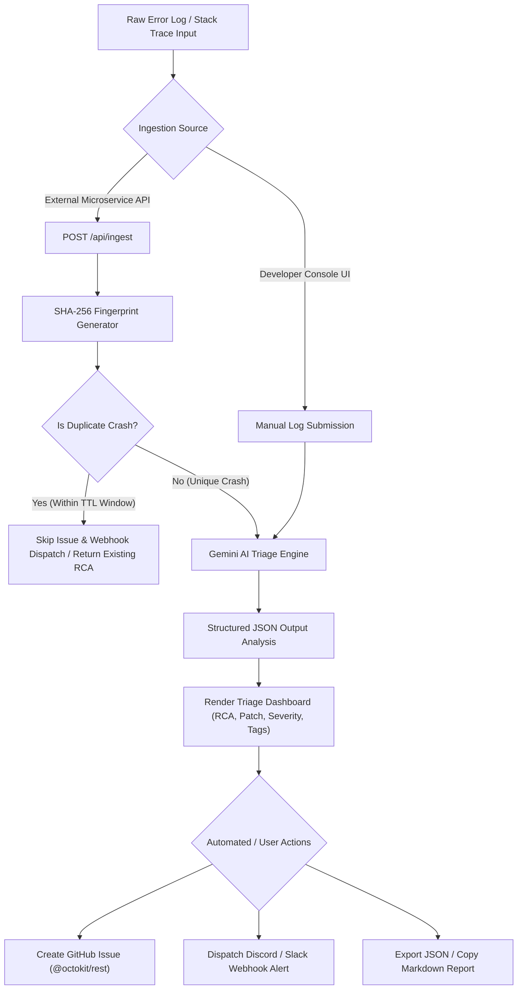

# AutoTriage AI - Software Bug Triage & Maintenance Engineer Agent
## Solution Design & Functional Specification (SRS)

---

## 📌 Executive Summary

**AutoTriage AI** is an autonomous **Software Bug Triage & Maintenance Engineer Agent** designed to eliminate operational friction during software development and production outage resolution. 

The application ingests application crash logs, runtime stack traces, and unhandled exception payloads, leverages Google Gemini AI with structured outputs (`responseSchema`) to perform Root Cause Analysis (RCA) and generate code fixes, and automatically executes downstream developer actions—including automated GitHub Issue creation, duplicate crash deduplication, and instant Discord/Slack webhook notifications.

---

## 1. 🎯 Agent Role Selection & Rationale

### 1.1 Chosen Role
**Principal Software Maintenance Engineer & Automated Bug Triaging Agent**

### 1.2 Rationale & Problem Statement
In modern software engineering organizations:
- **High MTTR (Mean Time To Resolution)**: Engineers spend up to 40% of their on-call shifts manually deciphering cryptic stack traces, searching log aggregators, and tracing line numbers to identify why a system crashed.
- **Context-Switching & Overhead**: Creating GitHub issues manually, writing reproduction steps, tagging labels, and posting alerts to Discord or Slack channels diverts developer focus away from active feature delivery.
- **Notification Spam**: Recurring crashes caused by the same underlying defect flood communication channels with duplicate alerts, creating alert fatigue.

### 1.3 Solution Impact
AutoTriage AI acts as a **24/7 First-Responder Engineer**:
1. **Instant Diagnosis**: Converts raw stack traces into human-readable Root Cause Analysis (RCA) and git-ready code patches in seconds.
2. **Proactive Automation**: Creates GitHub issues and dispatches rich team alerts automatically.
3. **Intelligent Deduplication**: Uses SHA-256 log fingerprinting to collapse recurring crashes and suppress duplicate channel spam.
4. **Traffic Resiliency**: Provides dynamic failover across Gemini AI models (`gemini-2.5-flash`, `gemini-2.5-pro`, `gemini-2.0-flash`, `gemini-1.5-flash`) during high-traffic spikes.

---

## 2. 🔄 Key Tasks and Workflows

AutoTriage AI automates five core engineering workflows:



### 2.1 Workflow Breakdown

| Workflow | Inputs | Processing Logic | Outputs |
| :--- | :--- | :--- | :--- |
| **1. Log Ingestion & Demo Presets** | Raw stack trace text, language/framework selector, target environment | Accepts manual text input or 1-click sample presets (`React Null Pointer`, `Node.js Unhandled Rejection`, `DB Connection Pool Timeout`, `Python Async Deadlock`, `Go Panic`) | Validated payload ready for triage |
| **2. AI Root Cause Analysis (RCA)** | Error log, target framework, active Gemini model | Queries `@google/genai` SDK with `responseSchema` JSON enforcement | Structured JSON containing Title, Severity (`P0`-`P3`), Category, RCA text, Code patch, and Tags |
| **3. Crash Deduplication** | Incoming log payload | Normalizes log text (stripping timestamps, memory addresses `0x...`, IP addresses) & hashes via SHA-256 | Unique fingerprint; skips duplicate GitHub/Webhook dispatches if active in TTL cache |
| **4. GitHub Issue Automation** | Triaged RCA report, GitHub PAT, repo owner/name | Formats markdown payload and calls Octokit REST API `issues.create` | Live GitHub Issue URL, issue number, and assigned labels |
| **5. Webhook Alert Dispatch** | Triaged RCA report, webhook URL, target platform | Builds Discord rich embed JSON or Slack markdown block kit attachment | Instant team notification in Discord or Slack channels |

---

## 3. 🏗️ High-Level Architecture & Technical Approach

AutoTriage AI is architected as a full-stack Next.js 15 application utilizing the App Router, TypeScript, and server-side API routes.

### 3.1 Frontend Architecture Component Tree

```
src/
├── app/
│   ├── page.tsx                     # Main Dashboard Container & State Hub
│   ├── globals.css                  # Tailwind CSS v4 & Dark Developer Theme
│   └── layout.tsx                   # Root HTML Shell
├── components/
│   ├── Header.tsx                   # Top Bar & Dynamic Model Switcher Dropdown
│   ├── LogForm.tsx                  # Log Submission Form & Sample Error Presets
│   ├── TriageCard.tsx               # Triage Result Card, RCA View, Action Bar
│   ├── CodeBlock.tsx                # Formatted Git Diff Code Viewer
│   ├── GitHubModal.tsx              # GitHub Issue Creation & Preview Modal
│   ├── WebhookModal.tsx             # Discord / Slack Webhook Dispatch Modal
│   ├── SettingsModal.tsx            # API Keys, Models & Env File Inspector
│   ├── IntegrationModal.tsx         # Backend Service Ingest & Dedup Stats Modal
│   ├── HistorySidebar.tsx           # Stored Session History Drawer with Filter
│   └── Toast.tsx                    # Universal Toast Notification Stack
```

### 3.2 Backend API Architecture

AutoTriage AI exposes five modular Next.js Server API Routes:

1. **`POST /api/triage`**: Ingests manual log submissions, queries Gemini AI via `@google/genai` SDK using `responseSchema`, and falls back to smart local heuristics if no API key is set.
2. **`POST /api/ingest`**: External microservice programmatic webhook endpoint. Performs SHA-256 fingerprint deduplication, runs Gemini AI triage, and triggers optional automated GitHub issue creation and Discord/Slack notification dispatches.
3. **`POST /api/github`**: Handles Octokit REST API calls to target GitHub repositories and formats issue bodies.
4. **`POST /api/webhook`**: Builds and dispatches rich Discord embeds (`embeds` array) or Slack markdown attachments (`blocks` array).
5. **`GET /api/settings/env`**: Server environment inspector that detects configured variables from `.env` / `.env.local` files and passes status badges to the frontend UI.

---

## 4. 🔌 Third-Party APIs & Integrations

### 4.1 Integration Specifications

| Integration | Library / SDK | Purpose | Configuration Source |
| :--- | :--- | :--- | :--- |
| **Google Gemini API** | `@google/genai` | Multi-model Root Cause Analysis (`gemini-2.5-flash`, `gemini-2.5-pro`, `gemini-2.0-flash`, `gemini-1.5-flash`, `gemini-1.5-pro`) using `responseSchema` | `GEMINI_API_KEY` or Settings Modal |
| **GitHub REST API** | `@octokit/rest` | Automated issue creation, markdown formatting, and label tagging | `GITHUB_TOKEN`, `GITHUB_OWNER`, `GITHUB_REPO` |
| **Discord Webhook API** | Native `fetch` HTTP POST | Real-time channel alerts with color-coded severity embeds | `DISCORD_WEBHOOK_URL` |
| **Slack Webhook API** | Native `fetch` HTTP POST | Real-time team notifications using Slack Block Kit attachments | `SLACK_WEBHOOK_URL` |

---

## 5. 🤖 Automation, User Interaction & Safety Mechanisms

### 5.1 Programmatic vs. Human-in-the-Loop Automation
AutoTriage AI provides dual-mode automation:
- **Developer Interactive Mode (UI)**: Developers paste stack traces, view formatted RCA and code diffs, preview GitHub issue bodies before posting, and trigger dispatches manually.
- **Autonomous Microservice Mode (API)**: Backend services (Node.js, Express, Python/FastAPI, Go/Gin) stream crash logs to `POST /api/ingest`. The agent autonomously performs RCA, creates GitHub issues, dispatches Webhook alerts, and deduplicates recurring logs without human intervention.

### 5.2 Failure Resiliency & Traffic Failover
- **Multi-Model Selector**: If a specific Gemini AI model faces high traffic or rate-limiting (`429 Too Many Requests`), the agent allows 1-click model switching in the top bar or settings modal.
- **Smart Fallback Engine**: If no API key is configured or network calls fail, the agent executes local stack trace heuristic pattern matching to generate an accurate RCA report so the app remains 100% functional.
- **Notification Spam Prevention**: The SHA-256 fingerprinting cache suppresses repetitive GitHub issues and Discord/Slack alerts for identical recurring crashes within the active TTL window.

---

> *Document generated for AutoTriage AI - Software Bug Triage & Maintenance Engineer Agent.*
